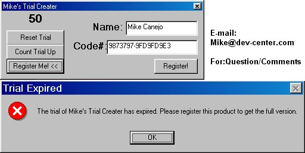



## Mike's Trial Creator

### Description

This is an example on how to make your programs have a trial counter on it.This example uses VB's "SaveSetting" and "GetSetting" to the number of times the program was opened. I made a function in here to detect

how many times it was open and if the number of times open is greater than the number you specify, then it displays a "Trial Over" message and exits the program. And also, if you wanted to add a "Register" part, I Included a "Reset TrialCount" feature so if they register it, make it "Registered" and stop the trial count. This is perfect if your working on a program and want it to be Shareware.
 
### More Info
 

             |
---                |---
**Submitted On**   |2000-04-23 02:43:28
**By**             |[Michael L\. Canejo](https://github.com/Planet-Source-Code/PSCIndex/blob/master/ByAuthor/michael-l-canejo.md)
**Level**          |Intermediate
**User Rating**    |4.8 (29 globes from 6 users)
**Compatibility**  |VB 4\.0 \(32\-bit\), VB 5\.0, VB 6\.0
**Category**       |[Miscellaneous](https://github.com/Planet-Source-Code/PSCIndex/blob/master/ByCategory/miscellaneous__1-1.md)
**World**          |[Visual Basic](https://github.com/Planet-Source-Code/PSCIndex/blob/master/ByWorld/visual-basic.md)
**Archive File**   |[CODE\_UPLOAD51024232000\.zip](https://github.com/Planet-Source-Code/michael-l-canejo-mike-s-trial-creator__1-7510/archive/master.zip)

